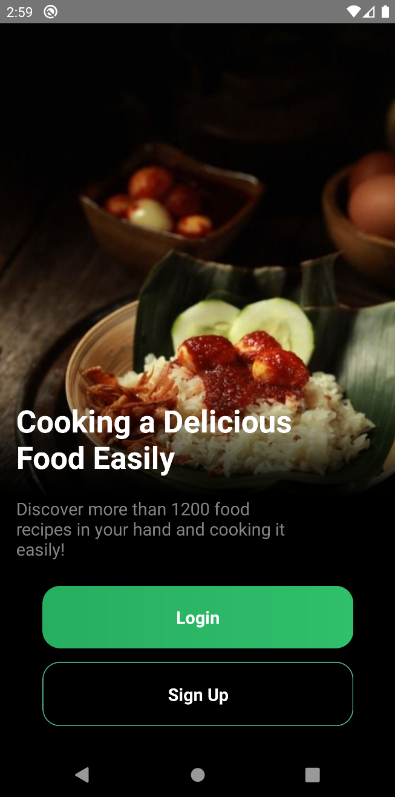
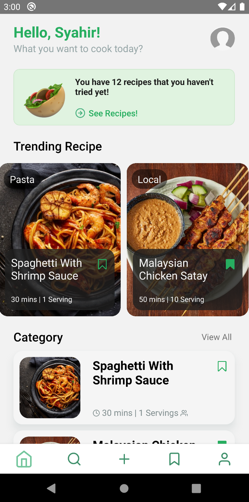
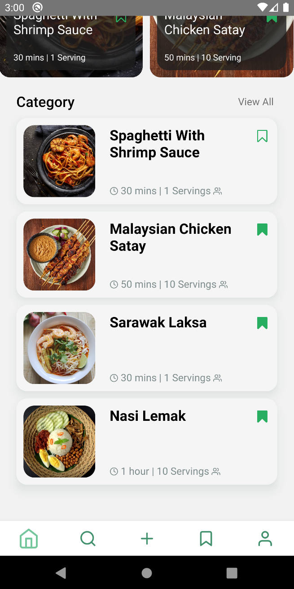
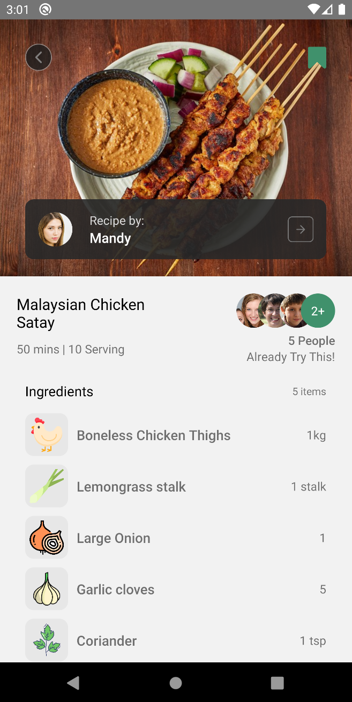
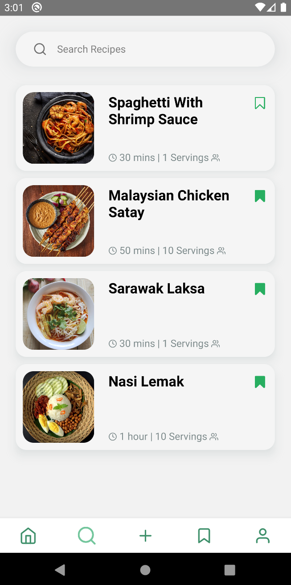
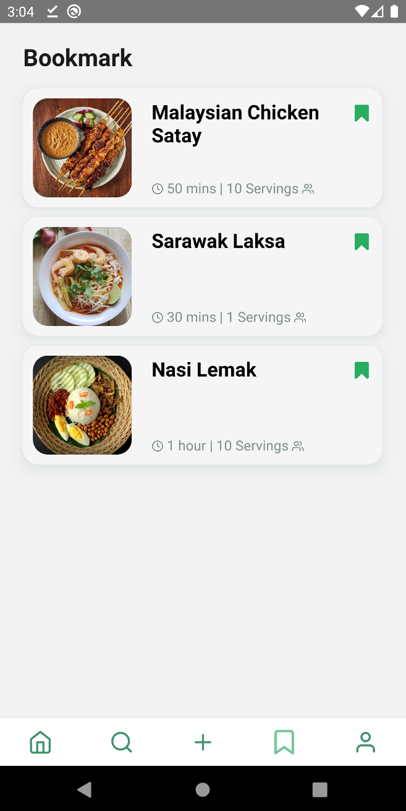
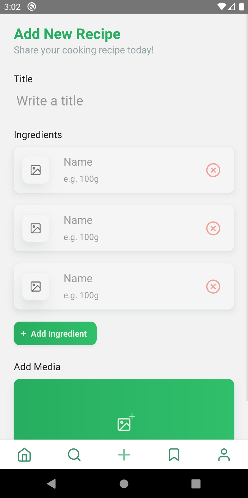
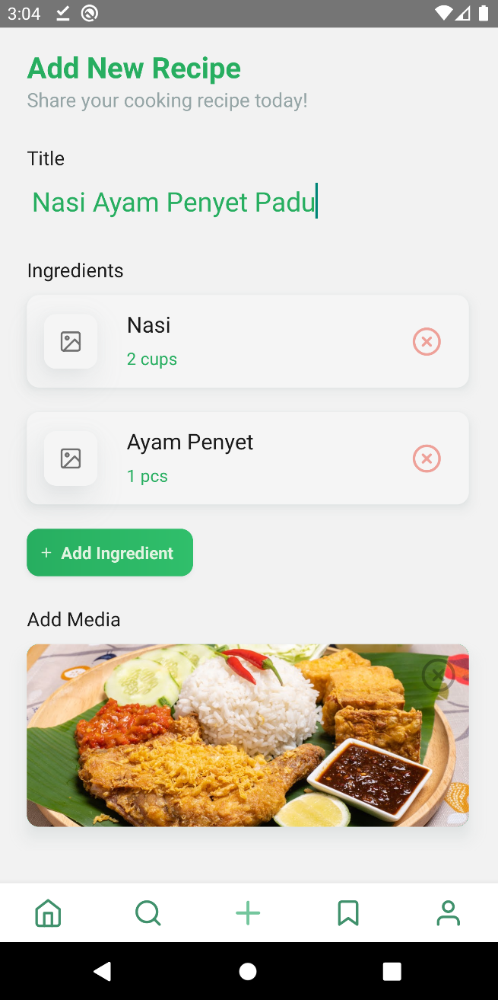

#About
######A food recipe app side project build with <a href="#"></a> <a href="#"></a> <a href="#"></a>

---

##Installation guide

####Running Server

```
$ git clone https://github.com/syahirdev/food-recipe.git
$ cd server
$ yarn install && yarn develop
```

####Running Client (Android)

```
$ cd client
$ yarn install && yarn start
$ yarn android
```

---

##Screenshots

###Landing Screen


---

###Home Screen



---

###Recipe Details Screen


---

###Search Screen



---

###Bookmark Screen


---

###Add New Recipe Screen


