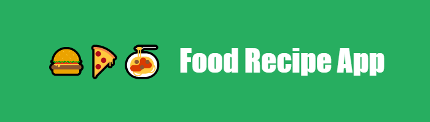
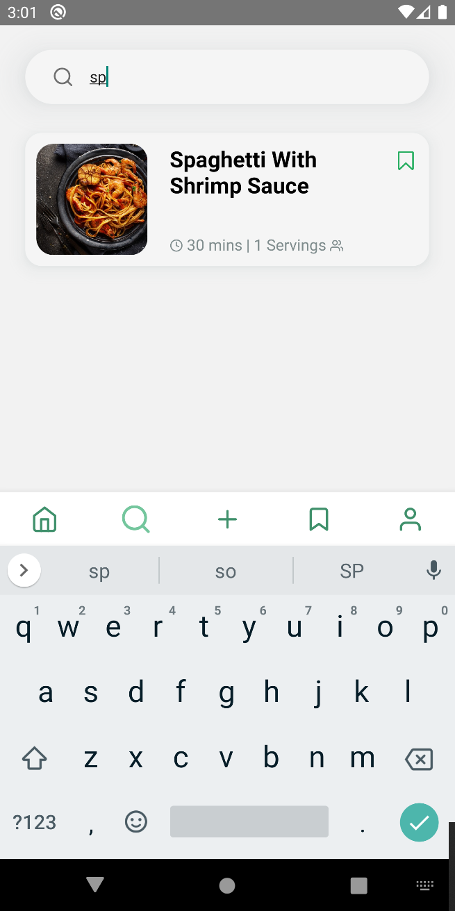

<p align="center">
  
</p>

# About
A food recipe app side project build with <a href="#"></a> <a href="#"></a> <a href="#"></a>

---

# Installation guide

### Running Server

1. install dependencies and run server side

```
$ git clone https://github.com/syahirdev/food-recipe.git
$ cd server
$ yarn install && yarn develop
```

### Running Client (Android)

1. add .env file into the folder `food-recipe/client/.env`
```
BASE_URL=http://192.168.x.x (replace with your own ip address)
```

> Note: to get the ip address for windows, open cmd and insert `ipconfig`, then select ipv4 address as the base_url.

2. install dependencies and run client side
```
$ cd client
$ yarn install && yarn start
$ yarn android
```

---

# Screenshots

### 1. Landing Screen


---

### 2. Home Screen


---

### 3 Recipe Details Screen


---

### 4. Search Screen



---

### 5. Bookmark Screen


---

### 6. Add New Recipe Screen


